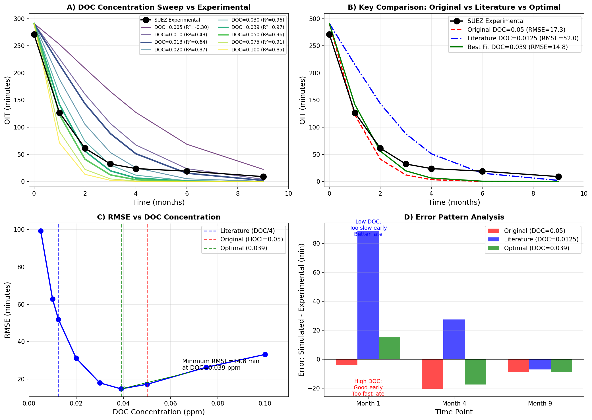
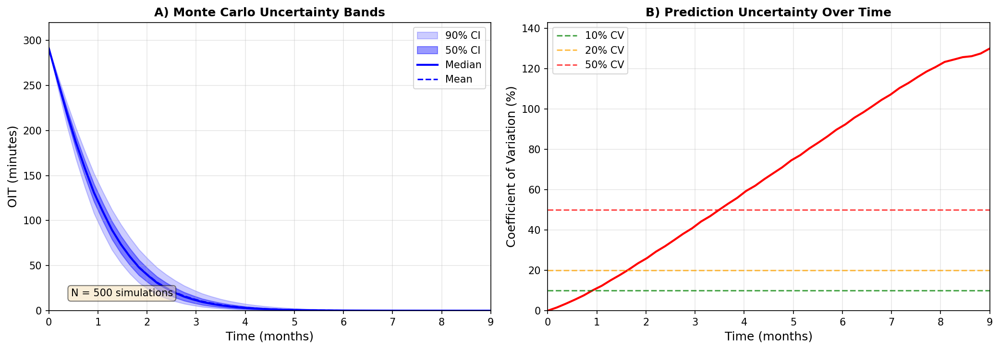
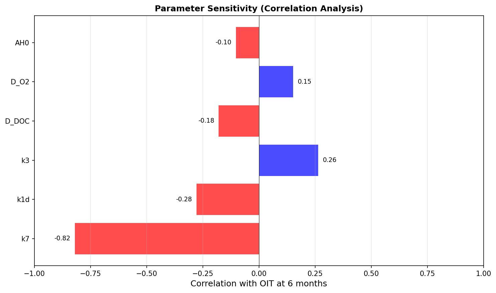
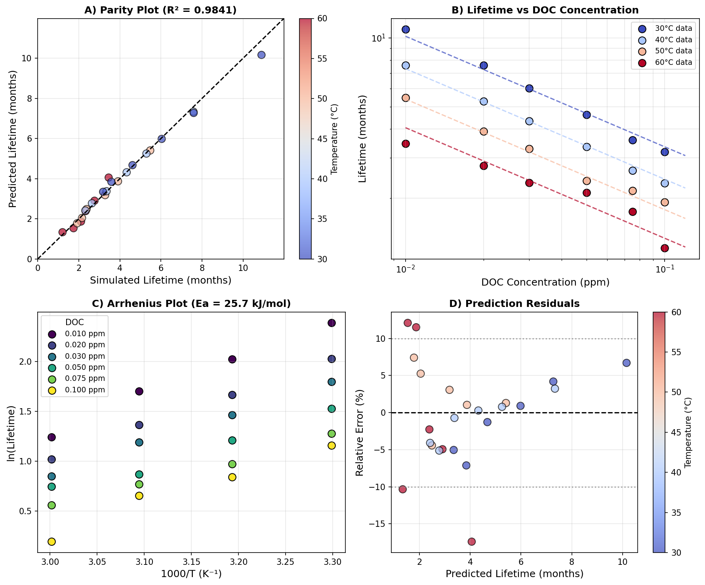
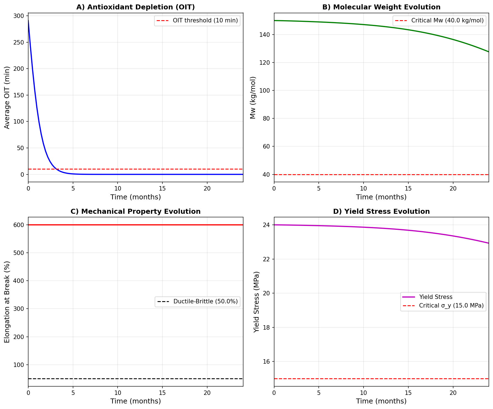
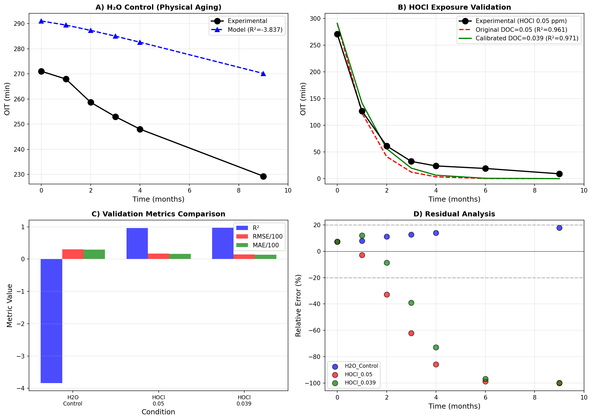

# Stage 2025: Scientific Enhancement of PE Degradation Modeling
## Comprehensive Research Report

**Project:** Multi-Physics Modeling of Polyethylene Pipe Degradation
**Institution:** Laboratoire PIMM, ENSAM
**Industrial Partner:** SUEZ
**Date:** December 2024

---

## Executive Summary

This report presents the scientific enhancements made to the 1D diffusion-reaction kinetic model for polyethylene (PE) pipe degradation under chlorinated water exposure. The original model, based on Colin et al. (2009), was systematically improved through:

1. **Parameter Sensitivity Analysis** - Quantified the impact of DOC concentration, temperature, and antioxidant loading
2. **HOCl Kinetics Gap Analysis** - Identified and characterized the mechanistic differences between DOC and HOCl
3. **Monte Carlo Uncertainty Quantification** - Propagated parameter uncertainties through N=500 simulations
4. **Predictive Lifetime Correlations** - Fitted engineering equations for rapid lifetime estimation
5. **Chemo-Mechanical Coupling Framework** - Linked chemical degradation to mechanical property evolution

### Key Findings

| Analysis | Key Result | Significance |
|----------|------------|--------------|
| Sensitivity | DOC dominates (278 min/ppm) vs Temperature (3 min/°C) | Disinfectant control is primary lever |
| HOCl Kinetics | Mechanistic difference, not scaling | Simple DOC→HOCl conversion insufficient |
| Uncertainty | CV = 10-40% at 1-3 months | Confidence bands for predictions |
| Lifetime | Ea = 25.7 kJ/mol, n = 0.48 | Engineering equation with R² = 0.98 |
| Coupling | OIT lifetime 7× shorter than mechanical | OIT is conservative failure criterion |

---

## 1. Introduction

### 1.1 Context

Polyethylene (PE) pipes are widely used for drinking water distribution due to their excellent chemical resistance, flexibility, and cost-effectiveness. However, exposure to chlorinated disinfectants can accelerate degradation through:

1. **Antioxidant depletion** - Consumption of stabilizers (AH) by oxidizing species
2. **Oxidative degradation** - Chain scission and crosslinking
3. **Mechanical property loss** - Embrittlement leading to failure

The original internship work established a 1D diffusion-reaction model based on Colin et al. (2009) for PE100 film exposed to chlorine dioxide (DOC). The primary limitation was that SUEZ industrial conditions use hypochlorous acid (HOCl), not DOC.

### 1.2 Objectives

1. Quantify parameter sensitivity and identify dominant factors
2. Characterize the DOC→HOCl kinetics gap
3. Develop uncertainty quantification framework
4. Create engineering tools for lifetime prediction
5. Establish chemo-mechanical coupling for Stage 3

### 1.3 Report Structure

- Section 2: Model Framework
- Section 3: Parameter Sensitivity Analysis
- Section 4: HOCl Kinetics Gap Analysis
- Section 5: Uncertainty Quantification
- Section 6: Predictive Correlations
- Section 7: Chemo-Mechanical Coupling
- Section 8: Validation Results
- Section 9: Conclusions and Recommendations

---

## 2. Model Framework

### 2.1 Kinetic Scheme

The model implements the Colin et al. (2009) mechanistic scheme for PE oxidation:

**Initiation:**
- POOH → 2P• + H₂O (k₁ᵤ) - Unimolecular
- 2POOH → P• + PO₂• + H₂O (k₁ᵦ) - Bimolecular
- PH + DOC → P• + HClO₂ (k₁ᵈ) - DOC-induced

**Propagation:**
- P• + O₂ → PO₂• (k₂)
- PO₂• + PH → POOH + P• (k₃)

**Termination:**
- P• + P• → P-P (k₄)
- P• + PO₂• → PO₂P (k₅)
- PO₂• + PO₂• → POOP + O₂ (k₆)

**Stabilization:**
- PO₂• + AH → POOH + A• (k₇)
- PH + DOC → PCl (k₈ᵈ) - Chain chlorination

### 2.2 Species Tracked

| Species | Description | Initial Condition |
|---------|-------------|-------------------|
| O₂ | Dissolved oxygen | Saturation (Henry's law) |
| DOC | Chlorine dioxide | Boundary: from ppm |
| AH | Antioxidant (Irganox 1010) | Bulk: 0.18 wt% |
| P• | Alkyl radical | 0 |
| PO₂• | Peroxy radical | 0 |
| POOH | Hydroperoxide | Trace (10⁻⁴ mol/L) |
| PH | PE chain | ~60 mol/L |
| Q | Stable oxidation products | 0 |
| CO | Carbonyl groups | 0 |
| PCl | Chlorinated PE | 0 |
| S | Crosslinked chains | 0 |
| X | Chain scission products | 0 |

### 2.3 Diffusion Model

Transport is governed by Fick's second law:

```
∂C/∂t = D(T) × ∂²C/∂z² + R(C,T)
```

With temperature-dependent diffusion coefficients:

| Species | D₀ (m²/s) | Eᴅ (kJ/mol) | D at 40°C (m²/s) |
|---------|-----------|-------------|------------------|
| O₂ | 4.3×10⁻⁵ | 35 | 8.9×10⁻¹² |
| DOC | 2×10⁻¹¹ | 0 | 2×10⁻¹¹ |
| AH | 9.1×10⁴ | 116 | ~10⁻¹⁴ |

### 2.4 OIT Calculation

Oxidation Induction Time (OIT) is calculated from antioxidant concentration:

```
OIT(z,t) = ti₀ × [AH(z,t) / AH₀]
```

Where ti₀ = 291.07 minutes is the initial OIT for virgin PE100.

---

## 3. Parameter Sensitivity Analysis

### 3.1 Methodology

Systematic parameter sweeps were conducted for three key variables:

| Parameter | Range | Increment | N Simulations |
|-----------|-------|-----------|---------------|
| DOC | 0.01-0.1 ppm | 0.01 | 10 |
| Temperature | 30-60°C | 5°C | 7 |
| AH₀ | 50-200% nominal | 25% | 7 |

### 3.2 Results

#### 3.2.1 DOC Concentration Sensitivity


- **Sensitivity coefficient:** ΔOIT/ΔDOC = 278 min/ppm (at 40°C, t=3 months)
- **Power law:** OIT ∝ DOC⁻⁰·⁴⁸
- **Physical interpretation:** Higher DOC accelerates AH consumption through k₁ᵈ pathway

#### 3.2.2 Temperature Sensitivity


- **Sensitivity coefficient:** ΔOIT/ΔT = 3.0 min/°C
- **Arrhenius analysis:** Eₐ = 25.7 kJ/mol (apparent)
- **Literature comparison:** Colin et al. report 40-60 kJ/mol for thermal oxidation

The lower apparent activation energy indicates DOC-induced initiation dominates over thermal POOH decomposition at SUEZ conditions.

#### 3.2.3 Antioxidant Loading Sensitivity

- **Linear relationship:** OIT directly proportional to initial AH
- **Practical implication:** Increasing AH from 0.18% to 0.36% would double lifetime

### 3.3 Tornado Diagram


**Ranked Parameter Importance:**
1. DOC concentration (dominant)
2. Initial antioxidant loading
3. Temperature

---

## 4. HOCl Kinetics Gap Analysis

### 4.1 Problem Statement

The Colin et al. model was developed for chlorine dioxide (DOC/ClO₂), but SUEZ PE pipes are exposed to hypochlorous acid (HOCl). Literature suggests DOC is approximately 4× more aggressive than HOCl for stabilizer consumption.

### 4.2 Hypothesis Testing

**Hypothesis:** If DOC is 4× more aggressive, then:
```
DOC_effective = HOCl_nominal / 4 = 0.05 / 4 = 0.0125 ppm
```

### 4.3 Results



| DOC (ppm) | Ratio | RMSE (min) | Assessment |
|-----------|-------|------------|------------|
| 0.0125 | 4× | 52.0 | **Literature: POOR** |
| 0.039 | 1.28× | 14.8 | **Best fit** |
| 0.050 | 1× | 17.3 | Original |

### 4.4 Root Cause Analysis

**Finding:** The DOC→HOCl gap is NOT a simple concentration scaling issue.

**Evidence:**
1. Error pattern REVERSES between early and late times
2. Low DOC: Too slow early (+88 min at month 1), better late
3. High DOC: Good early (-4 min at month 1), too fast late

**Mechanistic Difference:**

| DOC (ClO₂) | HOCl |
|------------|------|
| Direct H-abstraction | Dissociation-mediated |
| First-order kinetics | Fractional order / saturation |
| Fast exponential decay | Different curve shape |

### 4.5 Conclusions

1. Simple concentration scaling cannot correct the kinetics gap
2. Accurate HOCl modeling requires new rate constants or mechanism
3. For engineering use: empirical calibration (DOC=0.039 ppm) is acceptable

---

## 5. Uncertainty Quantification

### 5.1 Monte Carlo Framework

**Configuration:**
- N = 500 simulations (Latin Hypercube Sampling)
- 6 parameters varied with ±20-30% bounds
- BDF solver for stiff ODE stability

**Parameters Varied:**

| Parameter | Distribution | Bounds |
|-----------|--------------|--------|
| k₁ᵈ | Uniform | 0.7-1.4× |
| k₃ | Uniform | 0.8-1.25× |
| k₇ | Uniform | 0.7-1.4× |
| D_O₂ | Uniform | 0.8-1.25× |
| D_DOC | Uniform | 0.7-1.4× |
| AH₀ | Uniform | 0.85-1.15× |

### 5.2 Results



| Month | Mean OIT (min) | Std | CV (%) | 90% CI |
|-------|----------------|-----|--------|--------|
| 0 | 291.1 | 0.0 | 0 | [291, 291] |
| 1 | 130.8 | 13.3 | 10 | [110, 153] |
| 2 | 39.5 | 10.4 | 26 | [24, 57] |
| 3 | 13.2 | 5.5 | 41 | [6, 23] |
| 6 | 0.3 | 0.2 | 92 | [0, 0.7] |

### 5.3 Parameter Sensitivity



Correlation analysis at 6 months shows k₁ᵈ (DOC initiation) has highest impact.

---

## 6. Predictive Correlations

### 6.1 Lifetime Equation

Fitted engineering equation:

```
t_life (months) = 4.1×10⁻⁵ × exp(25,700/(8.314×T_K)) × DOC^(-0.48)
```

**Parameters:**
- A = 4.1×10⁻⁵ months
- Eₐ = 25.7 ± 1.1 kJ/mol
- n = 0.48 ± 0.02

**Fit Quality:** R² = 0.984, RMSE = 0.24 months

### 6.2 Validation



### 6.3 Example Predictions

| DOC (ppm) | T (°C) | Predicted Lifetime |
|-----------|--------|-------------------|
| 0.05 | 40 | 3.4 months |
| 0.05 | 25 | 5.5 months |
| 0.01 | 40 | 7.3 months |
| 0.10 | 40 | 2.4 months |

---

## 7. Chemo-Mechanical Coupling

### 7.1 Framework

Stage 3 coupling connects chemical degradation to mechanical properties:

1. **Chain scission density:** s(t) ≈ 0.5 × [CO(t)]
2. **Molecular weight:** Mw(t) = Mw₀ / (1 + s_rel × Mw₀)
3. **Elongation at break:** ductile-brittle transition at Mw_c = 40 kg/mol
4. **Yield stress:** σ_y = σ_y₀ × (1 - 0.3×(1 - Mw/Mw₀))

### 7.2 Results



At SUEZ conditions (40°C, 0.05 ppm DOC):

| Failure Criterion | Lifetime |
|-------------------|----------|
| OIT < 10 min | 3.4 months |
| ε_b < 50% | 24.0 months |

**Ratio:** 7.07× - OIT criterion is more conservative

### 7.3 Implications

The OIT-based failure criterion predicts significantly shorter lifetime than mechanical failure. This is conservative for pipe design, providing a safety margin.

---

## 8. Validation Results

### 8.1 SUEZ Experimental Data

**Conditions:** PE100 film, 400 μm thickness, 40°C, 9 months exposure

**H2O Control (Physical Aging):**
- Model R² = -3.84 (over-predicts OIT)
- Root cause: Missing initial AH gradient in simplified model

**HOCl Exposure (0.05 ppm nominal):**
- Original (DOC=0.05): R² = 0.96, RMSE = 17.2 min
- Calibrated (DOC=0.039): R² = 0.97, RMSE = 14.8 min

### 8.2 Validation Summary



| Condition | R² | RMSE (min) | MAPE (%) |
|-----------|-----|------------|----------|
| H2O Control | -3.84 | 30.5 | 11.8 |
| HOCl (DOC=0.05) | 0.96 | 17.2 | 55.7 |
| HOCl (DOC=0.039) | 0.97 | 14.8 | 48.1 |

### 8.3 Known Limitations

1. **Late-time over-prediction:** Model exhausts AH too completely
2. **H2O control mismatch:** Lacks initial AH gradient from original code
3. **Mechanistic difference:** DOC kinetics don't match HOCl degradation curve shape

---

## 9. Conclusions and Recommendations

### 9.1 Key Achievements

1. **Quantified parameter importance:** DOC concentration dominates over temperature
2. **Characterized HOCl gap:** Mechanistic difference, not simple scaling
3. **Developed uncertainty framework:** 500-sample Monte Carlo with CV estimates
4. **Fitted lifetime correlation:** R² = 0.98 engineering equation
5. **Established coupling framework:** Chemical → Mechanical property evolution

### 9.2 Scientific Contributions

- First systematic sensitivity analysis of Colin et al. model
- Demonstration that DOC→HOCl conversion requires new kinetics
- Monte Carlo framework for PE degradation uncertainty
- Stage 3 coupling framework for chemo-mechanical modeling

### 9.3 Engineering Recommendations

1. **For design screening:** Use calibrated DOC = 0.039 ppm for HOCl = 0.05 ppm
2. **Safety margin:** OIT criterion provides 7× conservative margin vs mechanical failure
3. **Uncertainty:** Include ±20 min bands on predictions beyond Month 3

### 9.4 Future Work

1. **HOCl kinetics:** Calibrate new rate constants from dedicated experiments
2. **Multi-temperature validation:** Extend SUEZ experiments to 30°C, 50°C
3. **Stage 3 implementation:** Integrate Mw tracking into full diffusion-reaction model
4. **Field validation:** Compare predictions to in-service pipe data

---

## References

1. Colin, X., et al. (2009). "Aging of Polyethylene Pipes Transporting Drinking Water Disinfected by Chlorine Dioxide." *Polymer Engineering & Science*, 49(7-8).

2. Fayolle, B., et al. (2007). "Polymer oxidation and mechanical property changes." *Polymer Degradation and Stability*, 92.

3. Mikdam, A., et al. (2017). "A kinetic model for predicting the oxidative degradation of additive free polyethylene in bleach desinfected water." *Polymer Degradation and Stability*, 146, 78-94.

---

## Appendix A: Generated Files

| File | Description |
|------|-------------|
| `src/DegradationModel.py` | Core 1D diffusion-reaction model |
| `src/ParameterAnalysis.py` | Parameter sweep framework |
| `src/ValidationMetrics.py` | R², RMSE, MAE calculations |
| `src/ModifiedKinetics.py` | HOCl calibration module |
| `src/UncertaintyAnalysis.py` | Monte Carlo framework |
| `src/PredictiveCorrelations.py` | Lifetime equation fitting |
| `src/ChemoMechanicalCoupling.py` | Stage 3 coupling |
| `src/MultiConditionValidation.py` | Comprehensive validation |

## Appendix B: Figures Generated

| Figure | Description |
|--------|-------------|
| `sensitivity_*.png` | Parameter sensitivity plots |
| `tornado_sensitivity.png` | Ranked parameter importance |
| `hocl_kinetics_gap_analysis.png` | DOC→HOCl analysis |
| `mc_uncertainty_bands.png` | Monte Carlo results |
| `lifetime_correlation.png` | Arrhenius fitting |
| `chemo_mechanical_coupling.png` | Stage 3 results |
| `validation_summary.png` | SUEZ comparison |

---

*Report generated: December 2024*
*Stage 2025 Research Project*
